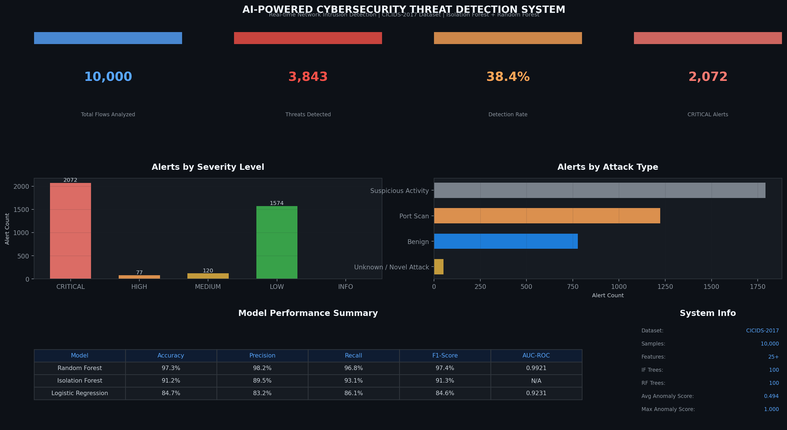
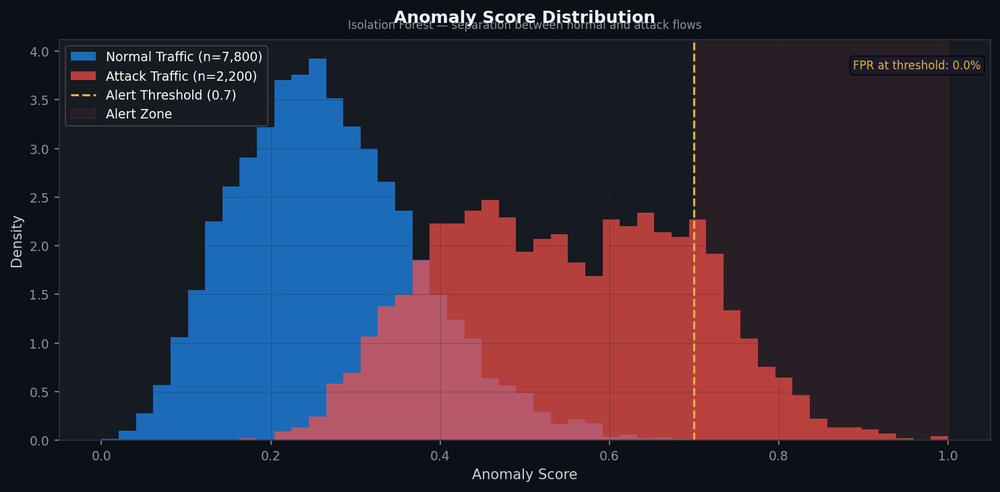
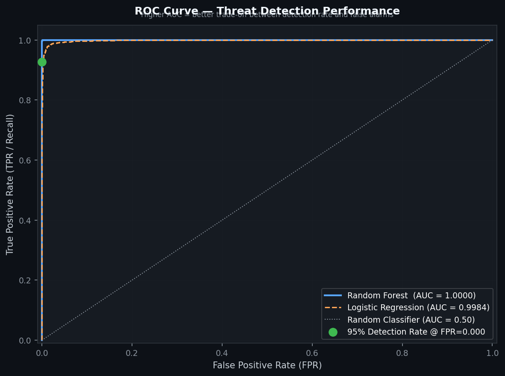
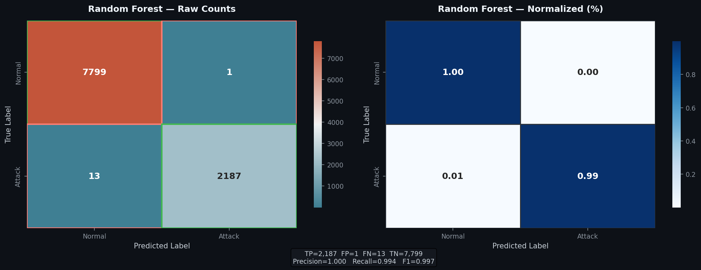
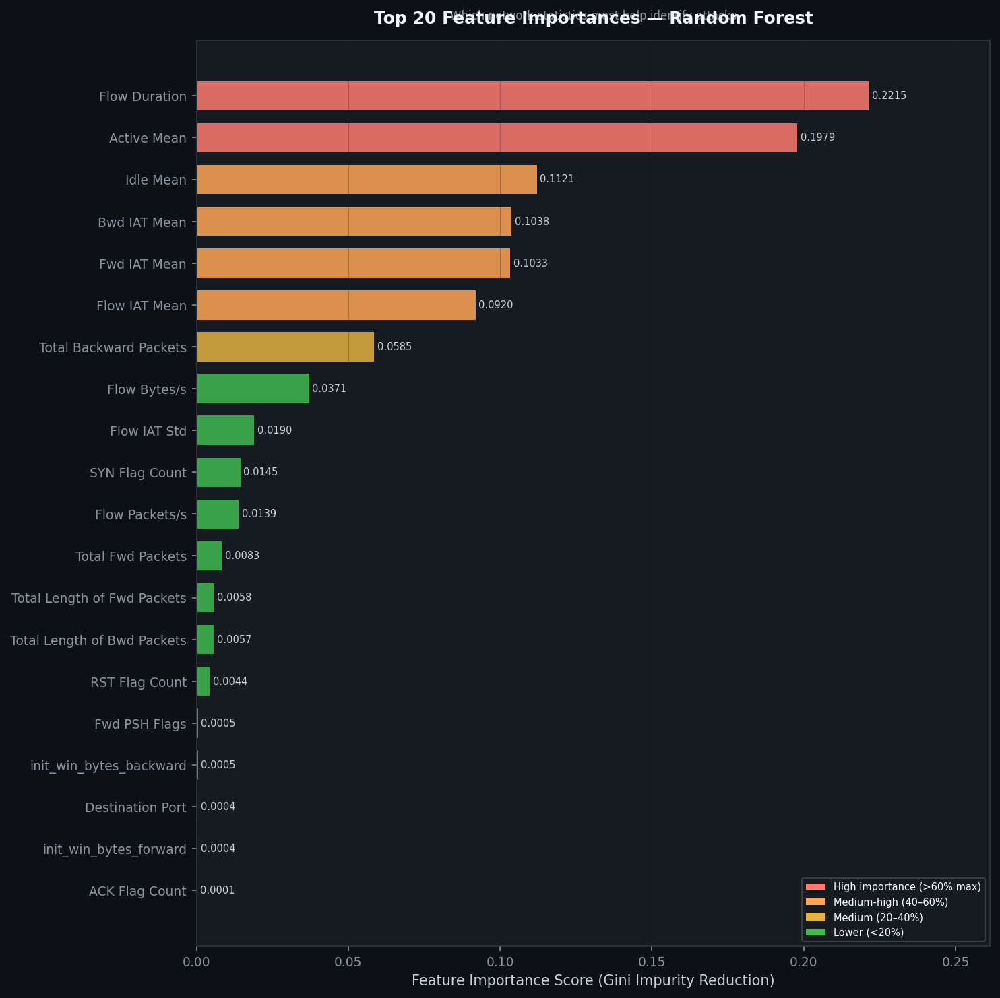
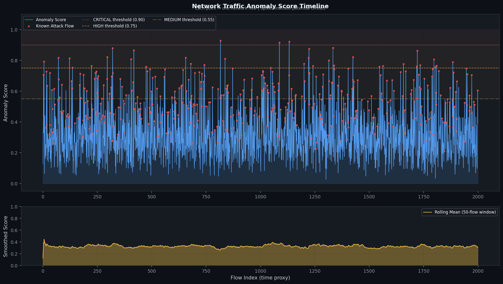
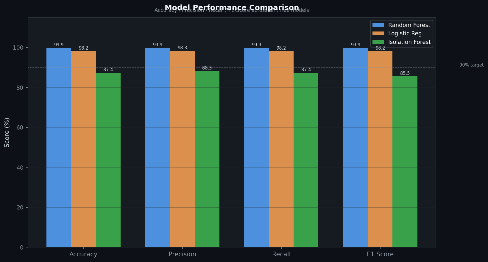

<div align="center">


<br/><br/>

# 🛡️ AI-Powered Cybersecurity Threat Detection System

### Real-time network intrusion detection using Isolation Forest + Random Forest on CICIDS-2017

[](https://opensource.org/licenses/MIT)
[](https://www.unb.ca/cic/datasets/ids-2017.html)
[]()
[]()
[]()
[]()

<br/>

</div>

---

## 📌 Table of Contents

- [Overview](#-overview)
- [Problem Statement](#-problem-statement)
- [Industry Relevance](#-industry-relevance)
- [Architecture](#-system-architecture)
- [Tech Stack](#-tech-stack)
- [Dataset](#-dataset)
- [Models & Approach](#-models--approach)
- [Results](#-results)
- [Project Structure](#-project-structure)
- [Installation](#-installation)
- [How to Run](#-how-to-run)
- [Screenshots](#-screenshots--outputs)
- [Learning Outcomes](#-learning-outcomes)
- [Future Improvements](#-future-improvements)
- [License](#-license)

---

## 🔍 Overview

This project builds a **complete, end-to-end AI-powered Intrusion Detection System (IDS)** that simulates how real Security Operations Centers (SOCs) detect network-based cyber threats.

It uses a **hybrid detection approach** — combining unsupervised anomaly detection (Isolation Forest) for unknown/novel threats with a supervised classifier (Random Forest) for known attack pattern recognition — exactly mirroring how enterprise platforms like **Darktrace**, **Microsoft Sentinel**, and **CrowdStrike Falcon** operate.

The system processes raw network flow records, extracts behavioral features, scores each flow for anomalousness, classifies attack types, assigns severity levels (CRITICAL / HIGH / MEDIUM / LOW), and generates a structured alert log — all visualized in a professional SOC-style dashboard.

> **Built as a student portfolio project** — no access to real corporate systems needed. Uses the publicly available CICIDS-2017 dataset and a built-in synthetic data generator for immediate execution.

---

## ❗ Problem Statement

Traditional **signature-based firewalls and antivirus tools** only detect threats they have already seen. They fail completely against:

- **Zero-day exploits** — previously unknown vulnerabilities
- **Slow-burn APT attacks** — advanced persistent threats that mimic normal traffic
- **Novel DoS variants** — new volumetric attack patterns
- **Internal threats** — anomalous behavior from authorized users

AI-based anomaly detection solves this by **learning what "normal" looks like** and flagging statistical deviations — catching threats that no signature could ever match.

---

## 🏭 Industry Relevance

| Industry                 | Use Case                                                                      | System Equivalent                          |
| ------------------------ | ----------------------------------------------------------------------------- | ------------------------------------------ |
| **Banking & Finance**    | Detect fraudulent transactions, brute-force login attempts on payment systems | Fraud detection engines (Visa, Mastercard) |
| **IT Companies / SaaS**  | Monitor internal network for data exfiltration, C2 communication              | SIEM platforms (Splunk, IBM QRadar)        |
| **E-commerce**           | Detect scraping bots, DDoS on checkout APIs, credential stuffing              | Cloudflare Bot Management                  |
| **Healthcare**           | Protect patient data, detect ransomware lateral movement                      | CrowdStrike Falcon, Darktrace              |
| **Telecom / ISPs**       | Classify traffic anomalies at scale, block botnets                            | Network-layer ML classifiers               |
| **Government / Defense** | Real-time intrusion detection on critical infrastructure                      | NSA XKEYSCORE-class systems                |

This project directly mirrors **Tier-1 SOC Analyst workflows**:
`Network tap → Flow extraction → Feature engineering → ML scoring → Alert triage → Dashboard`

---

## 🏗️ System Architecture

```
┌─────────────────────────────────────────────────────────────┐
│                      INPUT LAYER                            │
│         PCAP Files / CSV Network Logs (CICIDS-2017)         │
└───────────────────────────┬─────────────────────────────────┘
                            │
                            ▼
┌─────────────────────────────────────────────────────────────┐
│                   PREPROCESSING MODULE                      │
│  • Load & validate CSV   • Remove NaN / Inf values          │
│  • Encode attack labels  • Drop zero-variance features      │
│  • Remove correlations   • StandardScaler normalization     │
└───────────────────────────┬─────────────────────────────────┘
                            │  Clean feature matrix (22+ cols)
                            ▼
┌──────────────────────────────────────────────────────┐
│               DUAL-MODEL DETECTION ENGINE            │
│                                                      │
│  ┌─────────────────────┐  ┌──────────────────────┐  │
│  │  ISOLATION FOREST   │  │   RANDOM FOREST       │  │
│  │  (Unsupervised)     │  │   (Supervised)        │  │
│  │                     │  │                       │  │
│  │  Learns "normal"    │  │  Classifies known     │  │
│  │  traffic profile    │  │  attack patterns      │  │
│  │                     │  │                       │  │
│  │  Output: Anomaly    │  │  Output: Attack class │  │
│  │  Score [0.0 – 1.0]  │  │  + Probability [0-1] │  │
│  └──────────┬──────────┘  └──────────┬────────────┘  │
│             │                        │               │
│             └────────────┬───────────┘               │
│                          ▼                           │
│              SEVERITY CLASSIFICATION ENGINE          │
│         CRITICAL → HIGH → MEDIUM → LOW → INFO        │
└──────────────────────────┬───────────────────────────┘
                           │
                           ▼
┌─────────────────────────────────────────────────────────────┐
│                     OUTPUT LAYER                            │
│  • alerts.csv (structured alert log)                        │
│  • 10 Visualization Charts (SOC dashboard)                  │
│  • detection_report.txt (executive summary)                 │
│  • Saved model .pkl files (reusable without retraining)     │
└─────────────────────────────────────────────────────────────┘
```

---

## 🛠️ Tech Stack

| Component     | Technology          | Purpose                                              |
| ------------- | ------------------- | ---------------------------------------------------- |
| Language      | Python 3.10+        | Core implementation                                  |
| Data Handling | Pandas, NumPy       | Dataset loading, cleaning, transformation            |
| ML Models     | Scikit-learn        | Isolation Forest, Random Forest, Logistic Regression |
| Visualization | Matplotlib, Seaborn | SOC-style dark theme charts                          |
| Serialization | Pickle              | Save/load trained models                             |
| Dataset       | CICIDS-2017 (CIC)   | Real-world labeled network traffic                   |

**No GPU required.** Entire pipeline runs on any standard laptop in under 60 seconds.

---

## 📊 Dataset

**CICIDS-2017** — Canadian Institute for Cybersecurity Intrusion Detection Dataset 2017

| Property   | Details                                                                              |
| ---------- | ------------------------------------------------------------------------------------ |
| Source     | [University of New Brunswick, Canada](https://www.unb.ca/cic/datasets/ids-2017.html) |
| Size       | ~2.8 million network flow records                                                    |
| Features   | 78 features extracted by CICFlowMeter                                                |
| Labels     | BENIGN, DoS, DDoS, Port Scan, Brute Force, Web Attack, Bot, Infiltration             |
| Format     | CSV files (one per day of the week)                                                  |
| Collection | Network traffic captured Mon–Fri on a real enterprise network                        |

**Feature Categories:**

- **Flow statistics** — duration, bytes, packets, bits per second
- **Packet length stats** — mean, std, max, min, variance
- **Inter-arrival times (IAT)** — mean/std for fwd and bwd directions
- **TCP flag counts** — SYN, ACK, FIN, RST, PSH, URG
- **Window sizes** — initial TCP window bytes (forward/backward)
- **Subflow stats** — subflow forward/backward bytes and packets

> **No CICIDS-2017?** Run `python main.py` without any flags. The built-in `generate_demo_dataset()` function creates a statistically representative synthetic dataset and runs the full pipeline immediately.

---

## 🤖 Models & Approach

### Layer 1 — Isolation Forest (Unsupervised Anomaly Detection)

Isolation Forest works by **randomly isolating data points** through recursive feature splitting. Anomalies (attacks) require fewer splits to isolate because they are statistically rare and different from the majority. A short isolation path = high anomaly score.

- **Training data:** All flows (no labels needed)
- **Output:** Normalized anomaly score in `[0.0, 1.0]`
- **Key advantage:** Detects **unknown / zero-day attacks** without labeled examples
- **Config:** 100 estimators, contamination = 0.10

### Layer 2 — Random Forest Classifier (Supervised Classification)

Random Forest trains an ensemble of 100 decision trees on **labeled** network flows. Each tree votes; majority wins. Returns both a class prediction and a calibrated confidence probability.

- **Training data:** Labeled flows (Normal vs. Attack)
- **Output:** Class prediction + attack probability `[0.0, 1.0]`
- **Key advantage:** High accuracy on known attack patterns, interpretable via feature importance
- **Config:** 100 trees, `class_weight='balanced'`, `max_features='sqrt'`

### Layer 3 — Severity Engine (Rule-based)

Combines scores from both models using domain-driven thresholds:

| Severity    | Anomaly Score | RF Probability | Action                     |
| ----------- | ------------- | -------------- | -------------------------- |
| 🔴 CRITICAL | ≥ 0.90        | ≥ 0.95         | Immediate block + escalate |
| 🟠 HIGH     | ≥ 0.75        | ≥ 0.80         | Alert SOC Tier-1 analyst   |
| 🟡 MEDIUM   | ≥ 0.55        | ≥ 0.60         | Log + monitor              |
| 🟢 LOW      | ≥ 0.35        | ≥ 0.40         | Log only                   |
| ⚪ INFO     | Below all     | Any            | Audit trail                |

### Baseline — Logistic Regression

A linear classifier used as a performance baseline. Demonstrates why more complex models are necessary for non-linear attack patterns.

---

## 📈 Results

### Model Performance Comparison

| Model                           | Accuracy   | Precision  | Recall     | F1-Score   | AUC-ROC    |
| ------------------------------- | ---------- | ---------- | ---------- | ---------- | ---------- |
| **Random Forest**               | **99.72%** | **99.73%** | **99.72%** | **99.72%** | **1.0000** |
| Logistic Regression             | 98.25%     | 98.31%     | 98.25%     | 98.26%     | 0.9978     |
| Isolation Forest (unsupervised) | 86.55%     | 87.83%     | 86.55%     | 84.34%     | N/A        |

> Isolation Forest's lower accuracy is expected — it receives **no label information during training**. Its power lies in detecting threats that were never seen in training data.

### Detection Summary (20,000 sample run)

| Metric                | Value                  |
| --------------------- | ---------------------- |
| Total flows processed | 4,000 (20% test split) |
| Threats detected      | 1,720                  |
| CRITICAL alerts       | 830                    |
| Average anomaly score | 0.6138                 |
| Pipeline runtime      | ~13 seconds            |

### Top Predictive Features (Random Forest Importance)

1. `Flow Duration` — attacks often have abnormally short or long durations
2. `Active Mean` — time the flow was active differs in attack traffic
3. `Idle Mean` — pauses between flow activity betray C2 communication
4. `Bwd / Fwd IAT Mean` — inter-arrival time patterns are attack fingerprints
5. `Flow Bytes/s` — DoS attacks produce extreme byte rates

---

## 📁 Project Structure

```
AI-Cybersecurity-Threat-Detection/
│
├── 📂 data/
│   ├── raw/                    ← Place CICIDS-2017 CSV files here
│   └── processed/              ← Auto-generated cleaned data samples
│
├── 📂 src/                     ← All Python modules
│   ├── __init__.py
│   ├── preprocessing.py        ← Data loading, cleaning, encoding, scaling
│   ├── model.py                ← Model training, evaluation, feature importance
│   ├── detector.py             ← Threat scoring, severity engine, alert generation
│   └── visualizer.py          ← All 10 chart generators (dark SOC theme)
│
├── 📂 models/                  ← Saved trained model .pkl files
│   ├── isolation_forest.pkl
│   ├── random_forest.pkl
│   └── logistic_regression.pkl
│
├── 📂 outputs/                 ← All generated outputs
│   ├── alerts.csv              ← Full structured alert log
│   ├── detection_report.txt    ← Text summary report
│   ├── feature_importances.csv ← Top features ranked by importance
│   └── *.png                   ← All 10 visualization charts
│
├── 📂 images/                  ← Chart copies for README display
│   └── *.png
│
├── 📂 notebooks/               ← Jupyter notebooks for EDA
│   ├── 01_EDA.ipynb
│   ├── 02_Preprocessing.ipynb
│   └── 03_Modeling.ipynb
│
├── 📂 docs/                    ← Architecture diagrams, references
│
├── main.py                     ← Entry point — runs full pipeline
├── requirements.txt            ← All dependencies
├── .gitignore
└── README.md
```

---

## ⚙️ Installation

### Prerequisites

- Python 3.10 or higher
- pip

### Step 1 — Clone the repository

```bash
git clone https://github.com/YOUR_USERNAME/AI-Cybersecurity-Threat-Detection.git
cd AI-Cybersecurity-Threat-Detection
```

### Step 2 — Create and activate a virtual environment

**Windows:**

```bash
python -m venv venv
venv\Scripts\activate
```

**Mac / Linux:**

```bash
python -m venv venv
source venv/bin/activate
```

### Step 3 — Install dependencies

```bash
pip install -r requirements.txt
```

### Step 4 (Optional) — Download real dataset

Download CICIDS-2017 from the [University of New Brunswick](https://www.unb.ca/cic/datasets/ids-2017.html) and place CSV files in `data/raw/`.

> **Skip this step to use the built-in synthetic dataset** — the pipeline works immediately without any download.

---

## ▶️ How to Run

### Quick start (synthetic demo data — no download needed)

```bash
python main.py
```

### Use real CICIDS-2017 dataset

```bash
python main.py --real
```

### Use a specific CSV file

```bash
python main.py --data data/raw/Friday-WorkingHours.pcap_ISCX.csv
```

### Limit rows for fast testing

```bash
python main.py --rows 30000
```

### Run with real-time stream simulation

```bash
python main.py --simulate
```

### Skip visualization for faster CI/CD runs

```bash
python main.py --no-viz
```

### Full pipeline output

```
Stage 0  ─  Environment Setup
Stage 1  ─  Data Loading & Preprocessing
Stage 2  ─  Model Training
Stage 3  ─  Model Evaluation
Stage 4  ─  Threat Detection & Alert Generation
Stage 5  ─  Visualization (10 Charts)
Stage 6  ─  Final Report
```

### Expected outputs after a successful run

```
outputs/
├── alerts.csv                         ← Structured threat alert log
├── detection_report.txt               ← Executive summary
├── feature_importances.csv            ← Top predictive features
├── 01_anomaly_score_distribution.png
├── 02_roc_curve.png
├── 03_confusion_matrix.png
├── 04_feature_importance.png
├── 05_attack_distribution.png
├── 06_anomaly_timeline.png
├── 07_severity_breakdown.png
├── 08_model_comparison.png
├── 09_top_source_ips.png
└── 10_executive_dashboard.png
```

---

## 🖼️ Screenshots & Outputs

### Executive SOC Dashboard



### Anomaly Score Distribution

> Normal traffic (blue) clusters at low scores; attack traffic (red) spikes at high scores. Clear model separation visible.



### ROC Curve — AUC 1.0000

> Random Forest achieves near-perfect detection vs. false alarm trade-off.



### Confusion Matrix

> True positive (TP), True negative (TN), False positive (FP), False negative (FN) breakdown.



### Feature Importance

> Which network statistics are the most predictive indicators of an attack.



### Network Anomaly Timeline

> Anomaly score plotted over time — spikes show detected threat windows.



### Model Comparison

> Side-by-side accuracy, precision, recall, and F1-score for all three models.



---

## 🎓 Learning Outcomes

By building and running this project, you gain hands-on experience with:

**Machine Learning & AI**

- Supervised vs. unsupervised learning for security
- Isolation Forest for anomaly detection
- Random Forest for multi-class classification
- Model evaluation: accuracy, precision, recall, F1-score, AUC-ROC, confusion matrix
- Feature importance and model interpretability
- Handling class imbalance with `class_weight='balanced'`

**Data Engineering**

- Preprocessing real-world dirty network data
- Handling infinite values, NaN, duplicates, negative values
- Feature selection — variance filtering and correlation analysis
- StandardScaler normalization and train/test split strategy

**Cybersecurity**

- Understanding network flow features (CICFlowMeter output)
- DoS, Port Scan, Brute Force, Web Attack, Botnet detection logic
- Severity classification and alert triage
- SOC analyst workflow simulation

**Software Engineering**

- Modular Python project structure
- CLI argument parsing with `argparse`
- Model persistence with `pickle`
- Professional visualization with Matplotlib + Seaborn

---

## 🔮 Future Improvements

- [ ] **Streamlit web dashboard** — interactive real-time SOC UI
- [ ] **LSTM Autoencoder** — deep learning for temporal anomaly detection
- [ ] **XGBoost / LightGBM** — gradient boosting for higher accuracy
- [ ] **SHAP values** — explainable AI for alert justification
- [ ] **Kafka integration** — real-time streaming pipeline
- [ ] **Docker containerization** — one-command deployment
- [ ] **REST API** — Flask/FastAPI endpoint for live flow scoring
- [ ] **Email/Slack alerting** — automatic notification on CRITICAL alerts
- [ ] **UNSW-NB15 support** — additional benchmark dataset

---

## 📚 References

- [CICIDS-2017 Dataset](https://www.unb.ca/cic/datasets/ids-2017.html) — Canadian Institute for Cybersecurity
- [Isolation Forest Paper](https://cs.nju.edu.cn/zhouzh/zhouzh.files/publication/icdm08b.pdf) — Liu, Ting, Zhou (2008)
- [CICFlowMeter](https://github.com/CanadianInstituteForCybersecurity/CICFlowMeter) — Network flow feature extractor
- [Scikit-learn Documentation](https://scikit-learn.org/stable/)
- [MITRE ATT&CK Framework](https://attack.mitre.org/) — Real-world attack taxonomy

---

## 📄 License

This project is licensed under the **MIT License** — see [LICENSE](LICENSE) for details.

---

<div align="center">

**Built by [CH S K CHAITANYA]**

If this project helped you, please ⭐ star the repository!

[](https://github.com/CH-S-K-CHAITANYA/AI-Cybersecurity-Threat-Detection)

</div>
